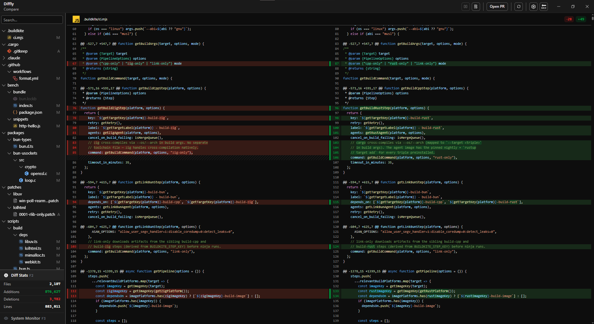
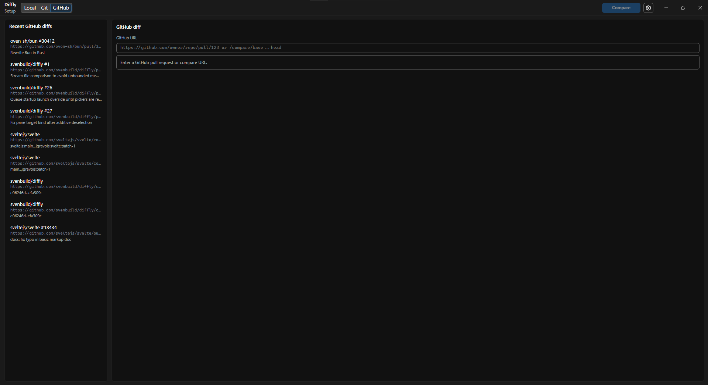

# Diffly

Diffly is a local desktop diff tool for comparing files, folders, Git working trees, Git commits, and GitHub diffs on Windows, macOS, and Linux. It is built with Svelte, TypeScript, and Electron, with a focus on fast navigation, readable diffs, and predictable desktop workflows.

## Download

Install the latest Windows, macOS, or Linux build from [GitHub Releases](https://github.com/svenbuild/diffly/releases/latest).

Current release: `v0.2.3`

Current prerelease: `v0.2.4-rc.1`

Supported desktop builds:

- Windows: NSIS installer and portable executable.
- macOS: DMG and ZIP.
- Linux: AppImage and DEB.

Note: Windows is the primary tested platform right now. macOS and Linux builds are available but have not been fully tested yet, so expect bugs. Issues and pull requests are very welcome.

## Features

- Compare files or full directory trees.
- Compare Git working trees, commit ranges, and single commits.
- Open GitHub pull request and compare links directly.
- Browse changed entries with a directory-aware sidebar.
- Switch between side-by-side and unified text diffs.
- Preview images and inspect binary files in a hex view.
- Add persistent comments to diff lines.
- Use Token Hover for quick syntax-token context.
- Keep large text, directory, and binary diffs responsive with virtual rendering.
- Restore local compare sessions and app state across restarts.
- Receive app updates through GitHub Releases.

## Screenshots





## Development

```bash
npm install
npm run electron:dev
```

Run checks before pushing changes:

```bash
npm run check
```

Build the default Windows installer and portable app on Windows:

```bash
npm run electron:package
```

Build platform-specific release packages on the matching OS:

```bash
npm run electron:package:win
npm run electron:package:mac
npm run electron:package:linux
```

## Links

- [Changelog](CHANGELOG.md)
- [Contributing](CONTRIBUTING.md)
- [Security](SECURITY.md)
- [Planning notes](docs/planning/README.md)
- [License](LICENSE)
